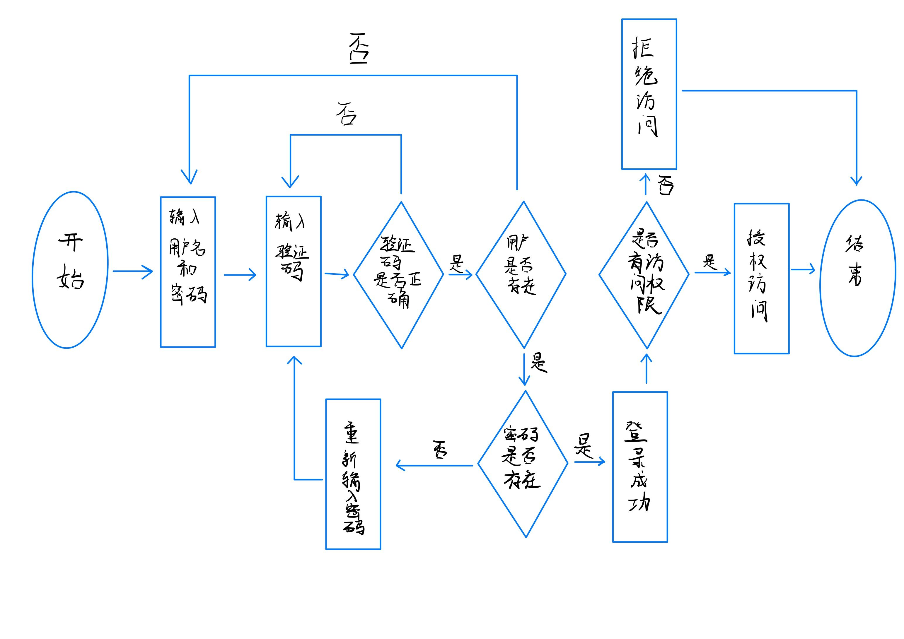
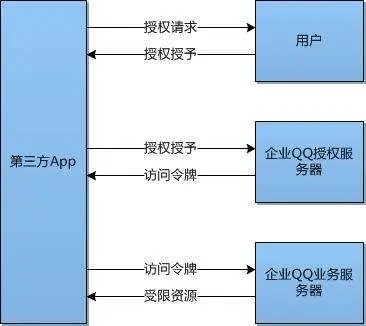

# 第二章实验

## 实验目的

- 操作系统的访问控制设计实例研究

## 实验环境

- 操作系统版本：Android 10
- 硬件设备型号：VCE-AL00
- 是否默认设置：是

## 实验结果

- 以 iOS 和 Android 系统为研究对象
当系统处于锁屏状态下接收到新短信时，不解锁情况下
  - 系统是否允许查看短信内容？
    - 是
  - 系统是否允许回复短信？
    - 否
- 安卓上的 App : 以 微信电话本 为例，在接管了系统短信功能和权限之后，是否会有一些不同的功能设定？
  - 是
- 当系统处于锁屏状态下，使用系统内置（例如 iOS 的 Siri ）或第三方的语音助手可以完成以下哪些操作？
  - 访问通讯录
    - 否
  - 拨打电话
    - 是
  - 访问相册
    - 否
  - 查看短信收件箱
    - 否
- 如果你的手机支持指纹识别解锁手机，请实验并分析指纹识别相比较于简单密码、复杂密码、图形解锁、人脸识别解锁、声纹解锁等解锁方式的安全性、便利性差异。
  - 安全性
    - 简单密码：小于指纹解锁，可被分析破解或者统计破解。
    - 复杂密码：分析破解更不容易，但是安全性还是没有指纹高。
    - 图形解锁：有可能被穷举分析，指纹则不存在此种攻击方式。
    - 人脸识别：人脸识别主要是特征识别，安全性在特征唯一的情况下可以保证。
    - 声纹解锁：容易伪造。
    - 指纹识别：指纹不容易出现重复，复制指纹不容易实现，安全性较好。
  - 便利性
    - 简单密码：容易记住，比较方便。
    - 复杂密码：输入较为麻烦，记忆也不方便。
    - 图形解锁：解锁需要画图，相较指纹不容易。
    - 人脸识别：方便，只需要人脸对着摄像头即可，但是可能受光线的影响。
    - 声纹解锁：需要说话，在安静的环境不方便。
    - 指纹识别：比较方便，手指一按就解锁，但是有时候手湿会影响准确性。

### 思考题

- 以上设计实现方式属于我们课堂上讲过的哪种强制访问控制模型？Lattice/BLP？Biba？
  - Biba
- 系统或第三方应用程序是否提供了上述功能的访问控制规则修改？如果修改默认配置，是提高了安全性还是降低了安全性？
  - 是。例如上面的微信电话本，可以修改权限。
  - 降低了安全性。

## 课后题

1. 生物特征身份认证方式有哪些？优缺点分析？应用场景举例。

- 指纹识别
  - 优点：
    - 指纹是人体独一无二的特征，并且它们的复杂度足以提供用于鉴别的足够特征；
    - 如果要增加可靠性，只需登记更多的指纹、鉴别更多的手指，最多可以多达十个，而每一个指纹都是独一无二的；
    - 扫描指纹的速度很快，使用非常方便；
    - 读取指纹时，用户必需将手指与指纹采集头相互接触，与指纹采集头直接接触是读取人体生物特征最可靠的方法；
    - 指纹采集头可以更加小型化，并且价格会更加的低廉；
  - 缺点：
    - 某些人或某些群体的指纹特征少，难成像；
    - 过去因为在犯罪记录中使用指纹，使得某些人害怕“将指纹记录在案”。实际上现在的指纹鉴别技术都可；
    - 以不存储任何含有指纹图像的数据，而只是存储从指纹中得到的加密的指纹特征数据；
    - 每一次使用指纹时都会在指纹采集头上留下用户的指纹印痕，而这些指纹痕迹存在被用来复制指纹的可能性。
  - 应用场景：计算机网络、政府机关、企事业单位、金融机构等。
- 声纹识别
  - 优点：
    - 声纹提取方便，可在不知不觉中完成，因此使用者的接受程度也高；
    - 获取语音的识别成本低廉，使用简单，一个麦克风即可，在使用通讯设备时更无需额外的录音设备；
    - 适合远程身份确认，只需要一个麦克风或电话、手机就可以通过网路(通讯网络或互联网络)实现远程登录；
    - 声纹辨认和确认的算法复杂度低；
    - 配合一些其他措施，如通过语音识别进行内容鉴别等，可以提高准确率。这些优势使得声纹识别的应用越来越受到系统开发者和用户青睐。
  - 缺点：
    - 同一个人的声音具有易变性，易受身体状况、年龄、情绪等的影响；
    - 不同的麦克风和信道对识别性能有影响；
    - 环境噪音对识别有干扰；
    - 混合说话人的情形下人的声纹特征不易提取。
  - 应用场景：公共安全领域、金融领域、能安防和智能家居等。
- 虹膜识别
  - 优点：
    - 便于用户使用；
    - 可能会是最可靠的生物识别技术；
    - 不需物理的接触；
    - 可靠性高
  - 缺点：
    - 很难将图像获取设备的尺寸小型化；
    - 设备造价高，无法大范围推广；
    - 镜头可能产生图像畸变而使可靠性降低；
    - 两大模块：硬件和软件；
    - 一个自动虹膜识别系统包含硬件和软件两大模块：虹膜图像获取装置和虹膜识别算法。分别对应于图像获取和模式匹配这两个基本问题。
  - 应用场景：门禁考勤、煤炭行业、建筑工地、银行金融等。
- 人脸识别
  - 优点
    - 非接触性，相比较其他生物识别技术而言，人脸识别是非接触的，用户不需要和设备直接接触。
    - 并发性，在实际应用场景中，人脸识别技术可以进行多个人脸的分拣、判断及识别。
    - 非强制性，被识别的人脸图像信息可以主动获取而不被被测个体察觉。
    - 自然性，所谓的自然性是指通过观察比较人脸来区分和确认身份;具有自然性的识别还有语音识别和体形识别。
  - 缺点
    - 人类脸部存在相似性，不同个体之间的区别不大，所有的人脸的结构都相似，甚至人脸器官的结构外形都很相似。这样的特点对于利用人脸进行定位是有利的，但是对于利用人脸区分人类个体是不利的。在加上化妆的掩盖及双胞胎的天然相似性更增加了识别的难度。
    - 人脸存在易变性，人脸的外形很不稳定，人可以通过脸部的变化产生很多表情，而在不同观察角度，人脸的视觉图像也相差很大。
  - 应用场景：金融领域、商业应用、智慧城市等。

2. “找回口令功能”和“忘记密码”在访问授权机制中的意义？请尝试设计几种安全的“找回口令功能”，详细描述找回口令的用户具体操作过程。

- 意义
  - 认证的实现过程就是将主体身份标识唯一的绑定到主体的过程。 身份认证是访问授权的基础。
  - 因为只有通过身份认证后用户才能获得相应的权限。而且如果用户忘记了密码（无法通过认证），就无法获得原先已有的权限。
- 设计
  - 在最开始注册时让用户绑定邮箱或者手机号
  - 当忘记密码需要找回密码时需输入绑定的邮箱或手机号
  - 输入时不提示输入是否正确
  - 随后向邮箱发送验证码
  - 输入验证码验证身份后重置

3. 绘制用户使用用户名/口令+图片验证码方式录系统的流程图。考虑认证成功和失败两种场景，考虑授权成功和失败两种场景。

4. Windows XP / 7 中的访问控制策略有哪些？访问控制机制有哪些？

- 自主访问控制 (Discretionary Access Control, DAC)
- 访问令牌 (access token)
- 安全描述符 (security descriptors)
  - 安全标识 (security identifiers, SID)
  - 访问控制列表 (access control list, ACL)
    - 自主访问控制列表(discretionary access control list, DACL)
    - 访问控制项(access control entries, ACE)
    - 系统访问控制列表(system access control list, SACL)

5. 用权限三角形模型来理解并描述下 2 种威胁模型：提权、仿冒。

- 提权： 提权从目的可分为纵向提权与横向提权：
  - 纵向提权：低权限角色获得高权限角色的权限。
  - 横向提权：获得同级别角色的权限.
- 仿冒： A用户仿冒B用户，这样就得到了B用户的权限,B用户的权限,但没有改变B用户的权限。

6. 试通过操作系统的访问控制机制来达到预防一种真实病毒的运行目的。

- 对于一个系统服务，管理员正确配置其调用的可执行文件的读写权限使得低权限用户没有对其程序的写入权限。这样就可以避免这个程序被病毒替换成任意可执行程序。

7. 什么是 OAuth？

- 你告诉QQ你授权A站访问你的部分资源而不用把密码给A站的一个权限代理协议。
  

8. 什么是 OpenID？

- OpenID 的创建基于这样一个概念：我们可以通过 URI （又叫 URL 或网站地址）来认证一个网站的唯一身份，同理，我们也可以通过这种方式来作为用户的身份认证。由于URI 是整个网络世界的核心，它为基于URI的用户身份认证提供了广泛的、坚实的基础。

9. 试用本章所学理论分析 0Auth 和 OpenID 的区别与联系。

- oauth2的目的用来授权，openid用来认证。openid提供对实体的鉴别，而OAuth更通用。当一个服务向第三方服务发行一个令牌可以用来访问一个被保护资源的令牌时，只要拥有令牌就能够访问其被授予的资源,而不管其身份。
- OpenID只做身份认证，没有授予权限，它只实现了证明“我是我”。OAuth授予第三方应用访问受保护的信息的权限。仅需作单纯的身份认证时没必要用到OAuth，用到第三方网站的外部服务时才需使用OAuth。

10. 如何使用 OAuth 和 OpenID 相关技术实现单点登录（Single Sign On）？

- 单点登录 (SSO) 是一种对于许多相互关连，但是又是各自独立的软件系统，提供访问控制的属性。当拥有这项属性时，当用户登录时，就可以获取所有系统的访问权限，不用对每个单一系统都逐一登录。
- 微软账户就是一个单点登录微软账户，使微软用户登录微软网站（如Outlook），运行在微软操作系统的设备（如Windows10电脑/平板、WindowsPhone、Xbox），微软应用软件（如Visual Stdio）。
- 微软的网站，服务，应用程序都可以使用同一个微软账户登录，而不需要多个账户。
- 也就是说，单点登录的实现是发生在服务器之间，如登录Outlook，用户身份的确认是由微软账户认证服务器实现，而不是Outlook服务器。