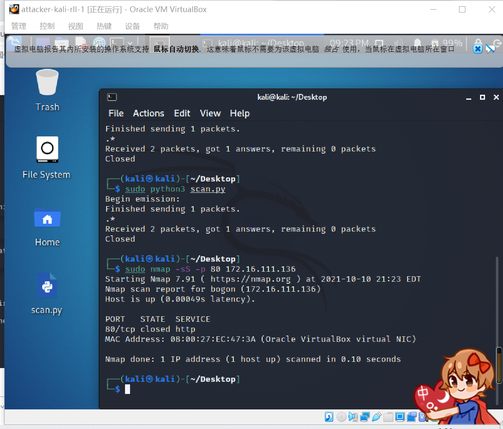
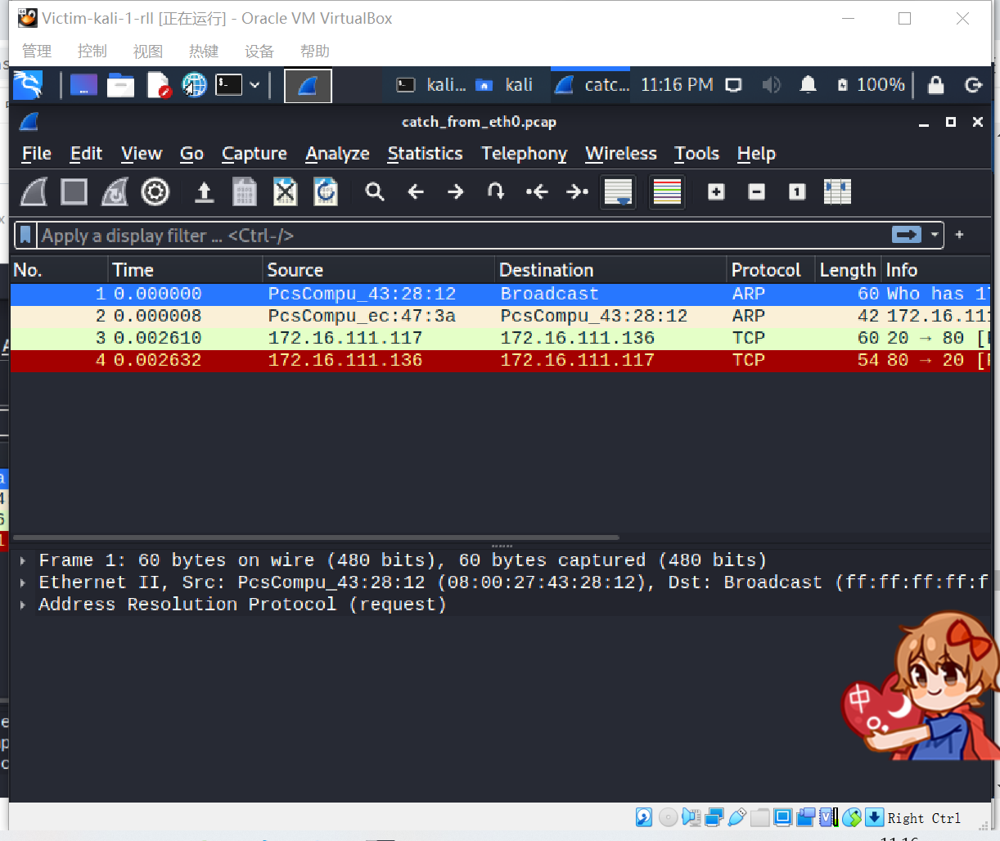

# 第五章实验 基于 Scapy 编写端口扫描器

## 实验目的

- 掌握网络扫描之端口状态探测的基本原理
  
## 实验环境

- python + scapy
- VirtualBox 虚拟机
- 攻击者主机（Attacker）：Kali
- 网关（Gateway, GW）：Debian Buster
- 靶机（Victim）：xp-sp3 / Kali
- 网络拓扑
  
  
## 实验要求

- 禁止探测互联网上的 IP ，严格遵守网络安全相关法律法规
- 完成以下扫描技术的编程实现
  - TCP connect scan / TCP stealth scan
  - TCP Xmas scan / TCP fin scan / TCP null scan
  - UDP scan
- 上述每种扫描技术的实现测试均需要测试端口状态为：开放、关闭 和 过滤 状态时的程序执行结果
- 提供每一次扫描测试的抓包结果并分析与课本中的扫描方法原理是否相符？如果不同，试分析原因；
- 在实验报告中详细说明实验网络环境拓扑、被测试 IP 的端口状态是如何模拟的
- （可选）复刻 nmap 的上述扫描技术实现的命令行参数开关
  
## 实验过程

### 端口状态模拟

- 关闭状态
   >#在靶机上安装ufw
    sudo apt-get install ufw
    #关闭防火墙
    ufw disable
    #关闭特定端口
    systemctl stop apache2
    systemctl stop dnsmasq
- 开启状态
  > systemctl start apache2
    systemctl start dnsmasq
- 过渡状态
  > ufw enable # 开启防火墙
    ufw enable && ufw deny 80/tcp
    ufw enable && ufw deny 53/udp

### TCP connect scan

- 全连接扫描也称TCP connect()扫描。
- 全连接扫描基于TCP三次握手规则，探测服务端口是否开放。
- 服务端口开放，会返回SYN/ACK消息；服务端口关闭，会返回RST/ACK消息。
- 如果目标主机没有任何响应则意味着目标主机的端口处于过滤状态。

#### 代码

> from scapy.all import *
  def tcpconnect(dst_ip, dst_port, timeout=10):
    pkts = sr1(IP(dst=dst_ip)/TCP(dport=dst_port,flags="S"),timeout=timeout)
    #无响应意味着目标主机的端口处于过滤状态
    if pkts is None:
        print("Filtered")
    elif(pkts.haslayer(TCP)):
        # 0x012:(SYN,ACK)包证明端口开放
        if(pkts.getlayer(TCP).flags == 0x12):
            #发送ACK确认包
            send_rst = sr(IP(dst=dst_ip)/TCP(dport=dst_port,flags="AR"),timeout=timeout)
            print("Open")
        # 0x014:(RST,ACK)包证明端口关闭
        elif (pkts.getlayer(TCP).flags == 0x14):
            print("Closed")
  #连接靶机
  tcpconnect('172.16.111.136', 80)

#### 实验步骤

##### 关闭状态

- 在靶机上输入`sudo ufw disable`使其变为关闭状态
  
- 将.py文件拖到攻击者主机内部执行
- 先在靶机进行抓包命令`sudo tcpdump -i eth0 -enp -w catch_from_eth0.pcap`，再在攻击者主机运行.py文件

- 打开文件

- 用nmap复刻

##### 打开状态

- 抓包结果
  
- 复刻结果
  

#### 过渡状态

- 抓包结果
  
- 复刻结果
  

### TCP stealth scan

#### 代码

> from scapy.all import *
def tcpstealthscan(dst_ip, dst_port, timeout=10):
    pkts = sr1(IP(dst=dst_ip)/TCP(dport=dst_port, flags="S"), timeout=10)
    # 无响应意味着目标主机的端口处于过滤状态
    if (pkts is None):
        print("Filtered")
    elif(pkts.haslayer(TCP)):
        # 0x012:(SYN,ACK)包证明端口开放
        if(pkts.getlayer(TCP).flags == 0x12):
            send_rst = sr(IP(dst=dst_ip) /
                          TCP(dport=dst_port, flags="R"), timeout=10)
            print("Open")
        # 0x014:(RST,ACK)包证明端口关闭
        elif (pkts.getlayer(TCP).flags == 0x14):
            print("Closed")
        # 两种不可达情况
        elif(pkts.haslayer(ICMP)):
            if(int(pkts.getlayer(ICMP).type) == 3 and int(stealth_scan_resp.getlayer(ICMP).code) in [1, 2, 3, 9, 10, 13]):
                print("Filtered")
  #连接靶机
  tcpstealthscan('172.16.111.136', 80)

#### 实验步骤

##### 关闭状态

- 抓包结果
  
- 复刻结果
  

#### 打开状态

 

- 抓包结果
  
- 复刻结果
  

#### 过渡状态

- 抓包结果
  
- 复刻结果
  

### TCP Xmas scan

#### 代码

> from scapy.all import *
def Xmasscan(dst_ip, dst_port, timeout=10):
    pkts = sr1(IP(dst=dst_ip)/TCP(dport=dst_port, flags="FPU"), timeout=10)
    if (pkts is None):
        print("Open|Filtered")
    # 0x014:(RST,ACK)包证明端口关闭
    elif(pkts.haslayer(TCP)):
        if(pkts.getlayer(TCP).flags == 0x14):
            print("Closed")
    elif(pkts.haslayer(ICMP)):
        if(int(pkts.getlayer(ICMP).type) == 3 and int(pkts.getlayer(ICMP).code) in [1, 2, 3, 9, 10, 13]):
            print("Filtered")
Xmasscan('172.16.111.136', 80)

#### 实验步骤

##### 关闭状态

- 抓包结果
  
- 复刻结果
  

##### 打开状态

- 抓包结果
  
- 复刻结果
  

##### 过渡状态

- 抓包结果
  
- 复刻结果
  

### TCP fin scan

在TCP报文结构中,FIN段负责表示发送端已经没有数据要传输了,希望释放连接. 我们发送一个FIN=1的报文到一个关闭的端口时,该报文会被丢掉,并返回一个RST报文.但是,当FIN报文到一个活动的端口时,该报文只是被简单的丢掉,而不回应任何信息.

#### 代码

> from scapy.all import *
def finscan(dst_ip, dst_port, timeout=10):
    pkts = sr1(IP(dst=dst_ip)/TCP(dport=dst_port, flags="F"), timeout=10)
    if (pkts is None):
        print("Open|Filtered")
    # 0x014:(RST,ACK)包证明端口关闭
    elif(pkts.haslayer(TCP)):
        if(pkts.getlayer(TCP).flags == 0x14):
            print("Closed")
    elif(pkts.haslayer(ICMP)):
        if(int(pkts.getlayer(ICMP).type) == 3 and int(pkts.getlayer(ICMP).code) in [1, 2, 3, 9, 10, 13]):
            print("Filtered")
finscan('172.16.111.136', 80)

#### 实验步骤

##### 关闭状态

- 抓包结果
  
- 复刻结果
  

##### 打开状态

- 抓包结果
  
- 复刻结果
  

##### 过渡状态

- 抓包结果
  
- 复刻结果
  

### TCP null scan

#### 代码

> from scapy.all import *
def nullscan(dst_ip, dst_port, timeout=10):
    pkts = sr1(IP(dst=dst_ip)/TCP(dport=dst_port, flags=""), timeout=10)
    if (pkts is None):
        print("Open|Filtered")
    elif(pkts.haslayer(TCP)):
        if(pkts.getlayer(TCP).flags == 0x14):
            print("Closed")
    elif(pkts.haslayer(ICMP)):
        if(int(pkts.getlayer(ICMP).type) == 3 and int(pkts.getlayer(ICMP).code) in [1, 2, 3, 9, 10, 13]):
            print("Filtered")
nullscan('172.16.111.136', 80)

#### 实验步骤

##### 关闭状态

- 抓包结果
  
- 复刻结果
  

##### 打开状态

- 抓包结果
  
- 复刻结果
  

##### 过渡状态

- 抓包结果
  
- 复刻结果
  

### UDP scan

#### 代码

> from scapy.all import *
def udpscan(dst_ip, dst_port, dst_timeout=10):
    resp = sr1(IP(dst=dst_ip)/UDP(dport=dst_port), timeout=dst_timeout)
    if (resp is None):
        print("Open|Filtered")
    elif (resp.haslayer(UDP)):
        print("Open")
    elif(resp.haslayer(ICMP)):
        if(int(resp.getlayer(ICMP).type) == 3 and int(resp.getlayer(ICMP).code) == 3):
            print("Closed")
        elif(int(resp.getlayer(ICMP).type) == 3 and int(resp.getlayer(ICMP).code) in [1, 2, 9, 10, 13]):
            print("Filtered")
        elif(resp.haslayer(IP) and resp.getlayer(IP).proto == IP_PROTOS.udp):
            print("Open")
udpscan('172.16.111.136', 53)

#### 实验步骤

##### 关闭状态

- 抓包结果
  
- 复刻结果
  

##### 打开状态

- 抓包结果
  
- 复刻结果
  

##### 过渡状态

- 抓包结果
  
- 复刻结果
  

## 参考资料

- [【安全百科】02 端口扫描原理—全连接扫描/Vanilla Scan/TCP connect()扫描](https://forum.huawei.com/enterprise/zh/thread-519549.html)
- [TCP SYN (Stealth) Scan (-sS)](https://nmap.org/book/synscan.html)
- [TCP FIN, NULL, and Xmas Scans (-sF, -sN, -sX)](https://nmap.org/book/scan-methods-null-fin-xmas-scan.html)
- [TCP，SYN，FIN扫描的介绍](https://blog.csdn.net/wyj880220/article/details/7287482)
- [UDP Scan (-sU)](https://nmap.org/book/scan-methods-udp-scan.html)