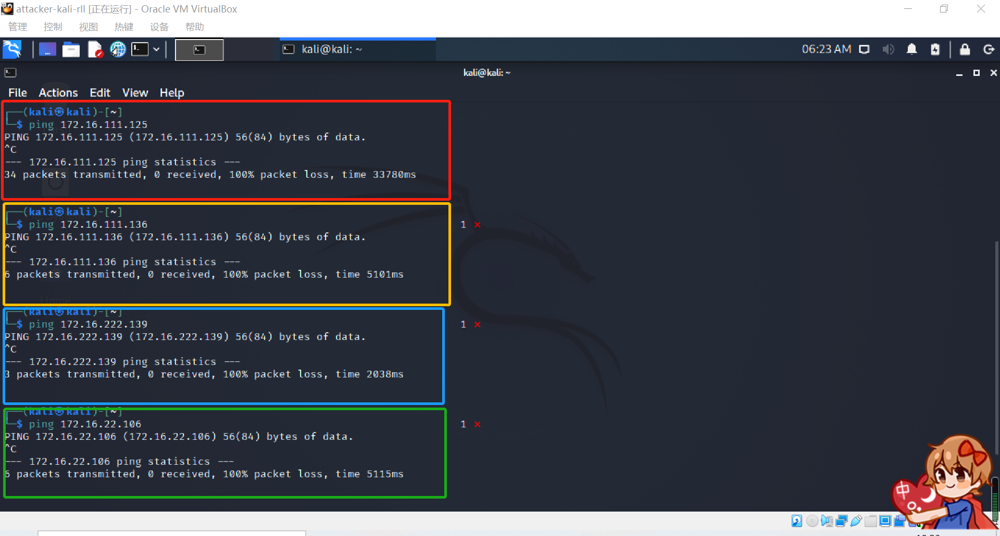

# 第一章实验 基于VirtualBox的网络攻防基础环境搭建
## 实验目的
- 掌握 VirtualBox 虚拟机的安装与使用；
- 掌握 VirtualBox 的虚拟网络类型和按需配置；
- 掌握 VirtualBox 的虚拟硬盘多重加载；
## 实验环境
- VirtualBox 虚拟机
- 攻击者主机（Attacker）：Kali 
- 网关（Gateway, GW）：Debian Buster
- 靶机（Victim）：xp-sp3 / Kali
## 实验过程
- 将虚拟硬盘配置成多重加载。
- 搭建虚拟机网络拓扑。
  1. 配置网关（Debian-gw-rll）
      
      网卡名称 | ip地址 
      :-    |:-
      enp0s3|10.0.2.15
      enp0s8|192.168.56.113
      enp0s9|172.16.111.1
      enp0s10|172.16.222.1
  2. 靶机
      靶机名称 | 网络类型 | ip地址
      :-      |:-       |:-
      Victim-xp-1-rll |intnet1|172.16.111.125
      Victim-kali-1-rll |intnet1|172.16.111.136
      Victim-xp-2-rll |intnet2|172.16.222.139
      Victim-kali-2-rll |intnet2|172.16.222.106 
  3. 攻击者主机
      名称 | 网络类型 | ip地址
      :-      |:-       |:-
      Victim-xp-1-rll |NAT|10.0.2.15
- 完成以下网络连通性测试；
  - 靶机可以直接访问攻击者主机
    
    
    
    
  - 攻击者主机无法直接访问靶机
    
  - 网关可以直接访问攻击者主机和靶机
    
    
    
    
    
  - 靶机的所有对外上下行流量必须经过网关
    
  - 所有节点均可以访问互联网
    
    
    
    
    
    
## 问题及解决办法
- 连接ssh时出现错误提示
  1. 输入`vi /etc/ssh/sshd_config`
  2. 将`PermitRootLogin prohibit-password`修改为`PermitRootLogin yes` 
  3. 重启ssh服务`/etc/init.d/ssh restart`
  4. 重新连接
- 设置NAT网络时提示无效设置
  回到virutualbox的界面，点击左上角的`管理——全局设定——网络——添加新的NAT网络`
## 参考资料
- [解决virtualbox虚拟机设置nat网络提示无效设置](https://jingyan.baidu.com/article/a3f121e4850c98fc9052bb97.html)
- [SSH登陆报错解决方案：Permission denied, please try again.](https://blog.csdn.net/weixin_44623010/article/details/105556481)
